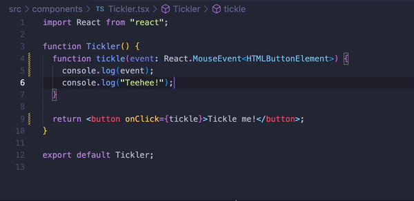

# Event Handling in React

## Learning Goals

- Understand how to use React events in our application
- Attach event listeners to JSX elements

## Overview

In this lesson, we'll cover the event system in React. We'll learn how to attach
event listeners to specific elements.

## Adding Event Handlers

Consider the following component:

```jsx
function Tickler() {
  function tickle() {
    console.log("Teehee!");
  }

  return <button>Tickle me!</button>;
}
```

We have a `tickle()` function, but no way to trigger it! This is a perfect time
to add an event listener so that we can see the message in our console. We
attach an event listener to an element much like we add a prop.

The listener name is always comprised of `on`, and the event name itself, for
example `click`. These are joined together and camel-cased, so if we wanted to
add a click handler, we'd call the prop `onClick`.

This prop takes a **callback function** as a value. It can either be a reference
to a function (like our `tickle()` function), or an inline function. Most of the
time, we'll use a function reference.

All together, it looks like this:

```jsx
<button onClick={tickle}>Tickle me!</button>
```

As you can see, we're passing a function _reference_, and not executing the
`tickle` function. Our updated component looks like this:

```jsx
function Tickler() {
  function tickle() {
    console.log("Teehee!");
  }

  return <button onClick={tickle}>Tickle me!</button>;
}
```

Now, when we click the button, we see a message in our console. Awesome!

We can also use an arrow function to define an event handler inline, and pass it
to the event listener:

```jsx
function Tickler() {
  return <button onClick={() => console.log("Teehee!")}>Tickle me!</button>;
}
```

Arrow functions are a good choice if your event handler doesn't need to handle
much logic. If you have more than one line of code to run in your event handler,
it's a good idea to create a separate callback function (like in the first
example).

## What Can We Listen For Events On?

One important thing to note about event listeners: you can only attach them to
DOM elements, _not_ React components. For example, this will not work:

```jsx
function Clickable() {
  return <button>Click Me</button>;
}

function App() {
  function handleClick() {
    console.log("click");
  }

  return <Clickable onClick={handleClick} />;
}
```

... but this will:

```jsx
function Clickable() {
  function handleClick() {
    console.log("click");
  }
  return <button onClick={handleClick}>Click Me</button>;
}

function App() {
  return <Clickable />;
}
```

If we want to make the first example work so that `handleClick` is called in
`App`, we'd have to pass `onClick` as a **prop** on the `Clickable` component,
like so:

```jsx
function Clickable({ onClick }) {
  return <button onClick={onClick}>Click Me</button>;
}

function App() {
  function handleClick() {
    console.log("click");
  }

  return <Clickable onClick={handleClick} />;
}
```

In this example, we're passing down a reference to the `handleClick` function as
a **prop** called `onClick` to the `Clickable` component. Then, we're using that
prop as the callback function for the `<button>` element's `onClick` attribute.
That way, when the `<button>` element is clicked, the callback function
`handleClick` will be called.

Whew! That's a lot to keep track of. We'll cover this concept of passing down
callback functions as props in more detail later on.

Let's explore a few other common event types and their use cases here. There's
some starter code provided, so feel free to code along and test things out in
the console!

> **Note**: TypeScript will give you a compilation error upon running the
> project. That's okay, just close it out for now by clicking the "X" in the top
> right corner in the browser. We will fix the error in a later section of this
> lesson!

### onClick

As we saw in the example above, adding a `click` event is pretty
straightforward!

Using our `Tickler` component as an example, let's see what else we can do with
a click event.

Update your component to look like this:

```jsx
function Tickler() {
  function tickle(event: React.MouseEvent<HTMLButtonElement>) {
    console.log(event);
  }

  return <button onClick={tickle}>Tickle me!</button>;
}
```

Just as in JavaScript, when we handle events in React, we can provide an `event`
parameter to our event handler callback function. Now that we're using
TypeScript, however, we also have to type our `event` so TypeScript knows what
kind of event the function should expect. Let's take a moment to discuss typing
events before we get back to the `onClick`.

### Event Types

When using React, we can take advantage of the type interfaces it provides. In
this particular case, for example, we're using the `React.MouseEvent` interface.
This type is used for, well, mouse events such as `onClick`, `onMouseEnter`,
`onDoubleClick` and plenty more.

All events fall under a specific umbrella, one being the aforementioned
`MouseEvent`. The type interfaces React provides for these events follow the
form of: `React.event-type<element-type>`. As we'll see soon, this means we not
only have to determine the type of the _event_, but we also have to determine
the type of the _element_ the event is tied to.

We'll learn more of these events and elements as we go along, but one important
thing to note is that this is where your IDE can come in handy. Assuming your
IDE supports TypeScript, hovering over an event attribute will show you the
umbrella type its return belongs to. For example:



Here, VSCode tells us that the `onClick` attribute expects a
`React.MouseEventHandler` to be passed to it. By extrapolation, this then tells
us the event that `onClick` will return to the handler is of type
`React.MouseEvent`.

However, as we saw, typing doesn't stop there.

When we're dealing with events, we can put them on virtually any DOM element we
want. In our `onClick` example, we put it on a `button` which is an
`HTMLButtonElement` type. But we could have put it on a `div` which is an
`HTMLDivElement` type. This means `React.MouseEvent` doesn't know the exact
element type the event came from.

This is where the `<>` syntax comes in. You may recall, this syntax denotes a
[**generic**][generics]. The event interfaces that React provides, such as
`React.MouseEvent`, are actually defined as generic interfaces. This give us the
flexibility to use events on any element we want.

We just have to make sure when we type the `event` parameter with one of those
generic interfaces, we also provide the HTML element's type within the generic
syntax `<>`.

Similar to how we found the interface type, hovering over the event attribute
will tell you what type the element is. Look again at the image above and see if
you can spot where we found the `button` is of type `HTMLButtonElement`.

All together, for our current example, we know:

- The _event_ type is `React.MouseEvent`.
- The _HTML element_ type the event is tied to is `HTMLButtonElement`.

That means the `event` parameter's type is:
`React.MouseEvent<HTMLButtonElement>`

Phew, this is a lot to take in! There are a lot of moving pieces when it comes
to events. It will be confusing at first, but with more practice it will start
to make sense. It may also help to try and map out where all the moving pieces
are going and what type each piece is.

### Back to onClick

With typing out of the way, let's get back to what `onClick` actually does. Here
is our current example again:

```jsx
function Tickler() {
  function tickle(event: React.MouseEvent<HTMLButtonElement>) {
    console.log(event);
  }

  return <button onClick={tickle}>Tickle me!</button>;
}
```

To review: when the button is clicked, it calls on the `tickle` function. The
function receives the click `event` as a parameter. With that, we can access all
the information about the `event` (such as the event `target`, mouse coordinates
via `clientX` and `clientY`, etc). Check out the console log to see what other
information there is - there's a lot!

What if we wanted to pass other information to the event handler though? In the
`MultiButton` component, we have three buttons that all share the same callback
function for their `onClick` event:

```jsx
function MultiButton() {
  function handleClick(number: number) {
    console.log(`Button ${number} was clicked`);
  }

  return (
    <div>
      <button onClick={handleClick}>Button 1</button>
      <button onClick={handleClick}>Button 2</button>
      <button onClick={handleClick}>Button 3</button>
    </div>
  );
}
```

When one of the buttons is clicked, we want the callback to log the button's
number. If you try clicking one of those buttons now, you'll still see the
`event` object being logged (it may look like `[object Object]`), not the number
of the button.

We could try this:

```jsx
function MultiButton() {
  function handleClick(number: number) {
    console.log(`Button ${number} was clicked`);
  }

  return (
    <div>
      <button onClick={handleClick(1)}>Button 1</button>
      <button onClick={handleClick(2)}>Button 2</button>
      <button onClick={handleClick(3)}>Button 3</button>
    </div>
  );
}
```

...but now, the console messages will appear as soon as our component is
rendered, not when the button is clicked. This is why we always need to provide
a _function definition_, not a _function invocation_ to our event handlers.

To get around that limitation when we need to pass arguments, we instead need to
define an anonymous inline function that returns a call to the handler:

```jsx
function MultiButton() {
  function handleClick(number: number) {
    console.log(`Button ${number} was clicked`);
  }

  return (
    <div>
      <button onClick={() => handleClick(1)}>Button 1</button>
      <button onClick={() => handleClick(2)}>Button 2</button>
      <button onClick={() => handleClick(3)}>Button 3</button>
    </div>
  );
}
```

By writing out an arrow function here, we're providing each of our button's
`onClick` handlers a _function definition_ that will only be _invoked_ when the
button is clicked.

What if we still want access to the event alongside some custom argument,
though? We can do that too! The inline anonymous function we defined is the
function the `onClick` calls, thus it's the one that can receive the `event` as
a parameter.

We just need to define it on the anonymous function, then we can pass it to our
handler function:

```jsx
function MultiButton() {
  function handleClick(
    event: React.MouseEvent<HTMLButtonElement>,
    number: number
  ) {
    console.log(event);
    console.log(`Button ${number} was clicked`);
  }

  return (
    <div>
      <button onClick={(event) => handleClick(event, 1)}>Button 1</button>
      <button onClick={(event) => handleClick(event, 2)}>Button 2</button>
      <button onClick={(event) => handleClick(event, 3)}>Button 3</button>
    </div>
  );
}
```

### onChange

The `onChange` attribute is useful for handling changes to _input values_. This
event listener is often used with `<input>`, `<select>`, and `<textarea>` inputs
(basically, anywhere you need to capture a user's input). The umbrella type this
event falls under is, appropriately, `React.ChangeEvent`.

Here's an example of using the `onChange` handler:

```jsx
function ChangeItUp() {
  function handleChange(
    event: React.ChangeEvent<HTMLInputElement | HTMLSelectElement>
  ) {
    console.log(`${event.target.name}: ${event.target.value}`);
  }

  return (
    <div>
      <input
        type="text"
        name="search"
        onChange={handleChange}
        placeholder="Enter search term..."
      />

      <select name="filter" onChange={handleChange}>
        <option value="all">Select a filter...</option>
        <option value="completed">Completed</option>
        <option value="incomplete">Incomplete</option>
      </select>
    </div>
  );
}
```

Here, we had to provide a union type to the generic because we're using the
function on two different elements: `input` and `select`.

Try it out and note that, as text is entered into the `<input>` field, its value
is captured using `event.target.value` and logged to the console.

### onSubmit

Whenever you're working with `<form>` elements, handling the submit event is a
good way to interact with all the data from the form after it's been submitted.
You can do so with the `onSubmit` attribute, which falls under the type
`React.FormEvent`.

Here's a quick example:

```jsx
function Login() {
  function handleSubmit(event: React.FormEvent<HTMLFormElement>) {
    event.preventDefault();
    console.log("I submit");
  }

  return (
    <form onSubmit={handleSubmit}>
      <input type="text" name="username" placeholder="Enter username..." />
      <input type="password" name="password" placeholder="Enter password..." />
      <button>Login</button>
    </form>
  );
}
```

When the form is submitted, just like in vanilla JavaScript, you must call
`event.preventDefault()` to prevent the form from making a network request.

We'll go into forms in more detail in a later lesson, and show the preferred way
for collecting data from _all_ the form input fields. For now, just remember:
use the `onSubmit` event handler, and always call `preventDefault()`!

## How Does React Handle Events?

You may have noticed when inspecting the `event` object that it's a bit
different than the standard browser event. React's `event` object is a special
object called: `SyntheticBaseEvent`.

React has its own event system with special event handlers called
`SyntheticEvent`. In fact, all the umbrella type interfaces we learned about are
extended from `SyntheticEvent`. As such, you can use `React.SyntheticEvent<>` to
type any of your `event` parameters. Still, it's always better to be more
explicit with your types and we recommend sticking to the more specific
umbrellas.

The reason for having a specific event system instead of using native events is
cross-browser compatibility. Some browsers treat events differently, and by
wrapping these events into a consistent API, React makes our lives a lot easier.
It's important to keep in mind that they are the _exact same events_, just
implemented in a consistent way! That means these events also have methods that
you can call like `preventDefault()`, `stopPropagation()`, and so on.

## Conclusion

In React, you can add event listeners to elements in JSX by providing an
`onEvent` attribute and passing a _callback function_ to be used as an event
handler. Some commonly used event listeners include `onClick`, `onChange`, and
`onSubmit`. You can find a full list of supported events
[here][react supported events].

React has its own internal events system that makes events behave consistently
across various browsers.

## Resources

- [Handling Events](https://reactjs.org/docs/handling-events.html)
- [React Synthetic Events](https://reactjs.org/docs/events.html)
- [Supported Events][react supported events]

[react supported events]: https://reactjs.org/docs/events.html#supported-events
[generics]: https://www.typescriptlang.org/docs/handbook/2/generics.html
